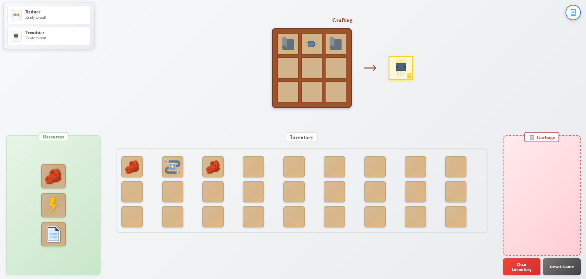

# Crearea unui Joc de Crafting în React

## Cerințe Generale
Selectați o tematică pentru obiecte și rețete.
### Configurare Proiect
- Creează un proiect `React` folosind `Vite`.
- Folosește fișiere `.json` pentru a stoca rețetele de creare și resursele.
### Stilizare & Interfață Utilizator (UI)
- Stilizarea puteți so implementați fie prin `CSS Module`, fie prin orice librărie doriți.
- Implementează sistem de [`drag-and-drop`](https://developer.mozilla.org/en-US/docs/Web/API/HTML_Drag_and_Drop_API) pentru mutarea obiectelor între inventar și zona de crafting (nu se permite utilizarea librăriilor de drag și drop).
## Funcționalități
### 1. Sistemul de Inventar și Resurse
Utilizatorul poate:
- Accesa resurse de bază (generarea la infint a acestora).
- Organiza obiectele în inventar.
- Șterge obiecte.
### 2. Sistemul de Crafting
Fiecare rețetă are:
- Un design cu ingrediente specifice.
- Un rezultat cu nume, descriere și imagine asociată.

Sistemul de crafting include:
- Detectarea automată a rețetelor valide în timpul plasării obiectelor.
- Afișarea vizuală a obiectului rezultat înainte de confirmare.      
- Adăugarea automată a obiectelor noi în inventar după creare.     
### 3. Panoul de Descoperire
- Afișează următoarele obiecte care pot fi create cu resursele disponibile descoperite.
### 4. Persistență și Progres
- Salvarea progresului în localStorage (obiecte descoperite, inventar).
- Sistem de victorie la crearea obiectului final.     
- Posibilitatea de resetare completă a jocului.

## Barem de notare
| Punctaj | Sarcina |
|---------|--------------------------------------------------------------------------------------------------------------|
| 0.5     | Crearea corectă a proiectului cu Vite și structura de fișiere|
| 0.5     | Utilizarea fișierelor JSON pentru salvarea rețetelor și resurselor|
| 0.5       | Afișarea panoului de câștig la crearea ultimului obiect|
| 0.5       | Abilitatea de resetare a jocului  |              
| 1       | Afișarea corectă a panoului de        descoperire|
| 1       | Crearea și utilizarea corectă a state-ului, efectelor secundare și context-ului, cât și a custom hook-urilor|
| 1       | Salvarea corectă a progresului între refresh-uri |
| 2       | Implementarea completă a sistemului de crafting cu validarea rețetelor|
| 2       | Implementarea sistemului drag-and-drop & inventar|

### Exemplu de rezolvarea a laboratorului este [aici](https://rn-lab1.vercel.app/).